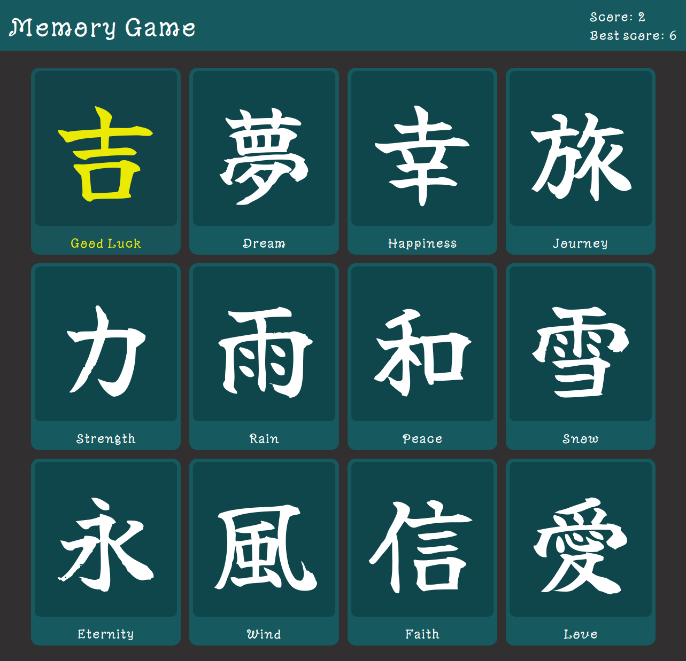
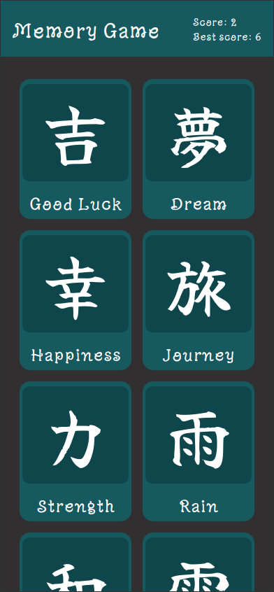

# The Odin Project #19: Memory Card Game

The goal of this Odin Project assignment was to create a memory card game.

I started and finished this project in June 2023.

## Assignment

[The Odin Project - React - #19 Memory Card](https://www.theodinproject.com/lessons/node-path-react-new-memory-card)

## Technology

- React
- JavaScript
- Vite
- CSS

## Key Concepts

- State: useState, changing state, updating state objects and arrays
- useEffect: syntax, dependencies array
- Props & passing data between components
- Event listeners in React
- JSX

## Links

[Live Demo](https://brightneon7631.github.io/odin-memory-card/)

[My Other Projects](https://brightneon7631.github.io/odin-scrimba-projects/)

## Screenshots

### Desktop



### Mobile



## Deployment

```bash
# clone repo
git clone

# install project dependencies
npm install

# run vite dev server
npm run dev

# create a production build
npm run build
```
